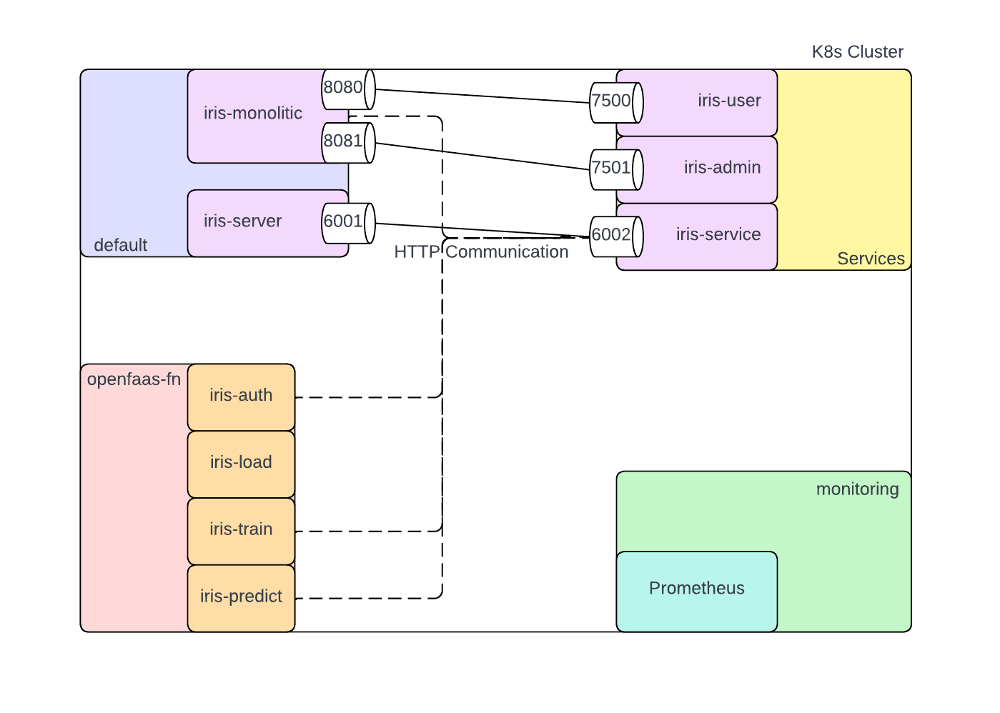
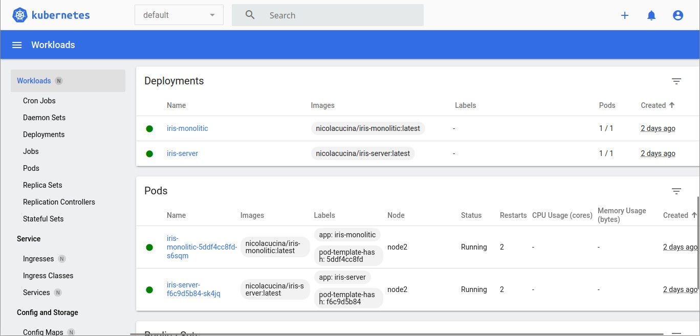
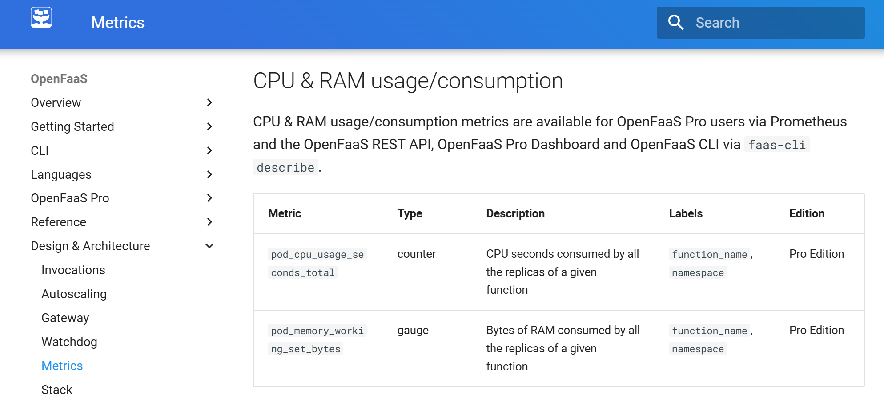
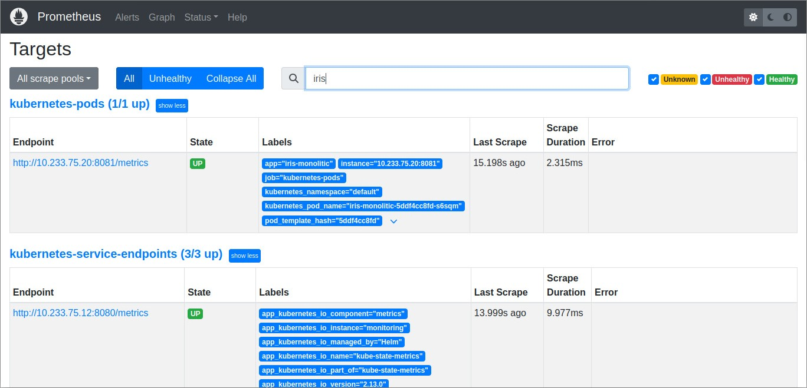
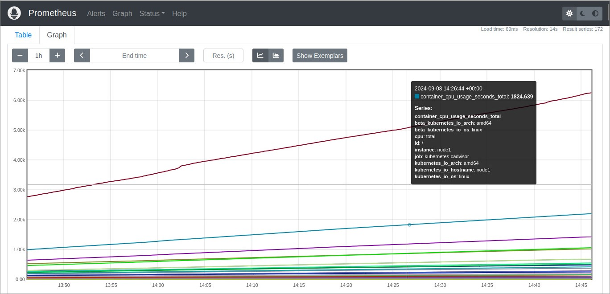
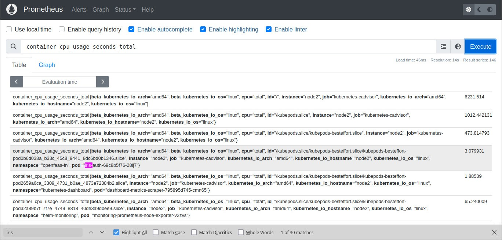
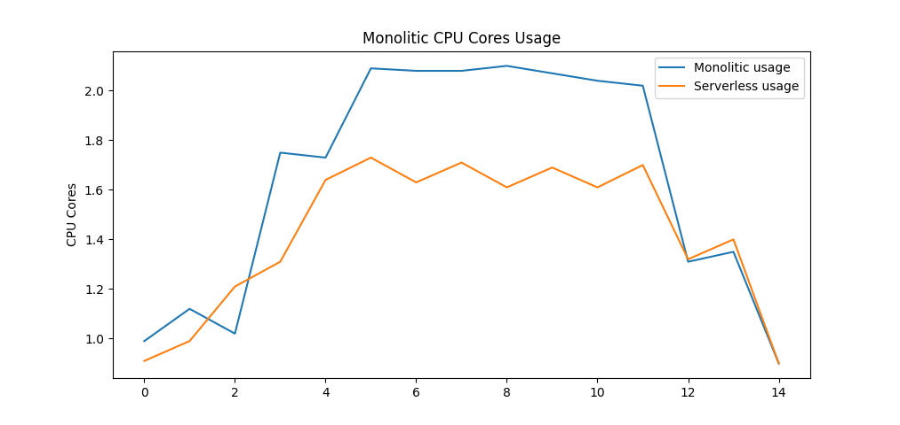

# Confronting monolitic and serverless approches to software development 

## Table of Contents

- [Implementation](#implementation)
  - [Iris-server](#iris-server)
  - [OpenFaaS implementation](#openfaas-implementation)
  - [Monolithic implementation](#monolithic-implementation)
- [Monitoring](#monitoring)
  - [Kubernetes Dashboard](#kubernetes-dashboard)
  - [Prometheus](#prometheus)
    - [Step 0: Getting the Prometheus Kubernetes Manifest Files](#step-0-getting-the-prometheus-kubernetes-manifest-files)
    - [Step 1: Create a Namespace](#step-1-create-a-namespace)
    - [Step 2: Create a ClusterRole for RBAC policy](#step-2-create-a-clusterrole-for-rbac-policy)
    - [Step 3: Create a Config Map To Externalize Prometheus Configurations](#step-3-create-a-config-map-to-externalize-prometheus-configurations)
    - [Step 4: Annotate Your Services and Deployment for Prometheus Scraping](#step-4-annotate-your-services-and-deployment-for-prometheus-scraping)
    - [Step 5: Create a Prometheus Deployment](#step-5-create-a-prometheus-deployment)
    - [Step 6: Connecting To Prometheus Dashboard](#step-6-connecting-to-prometheus-dashboard)
    - [Step 7: Grafana](#step-7-grafana)
    - [Step 8: Comparing the metrics](#step-8-comparing-the-metrics)

This repository contains code that will be used to confront the "classic" or _monolitic_ approch to software development against the more recent _serveless_ way using Prometheus metrics.




## Implementation

The code is a simple python example of machine learning training and predictions services, using authentication and adding some fake load to pan out the execution time.

The monolitic code will be executed inside a _Kubernetes_ Pod while the serverless version will be served using _OpenFaas_ .

### Iris-server

Both the monolitic and the serverless codes need to contact a web server for a simple form of authentication and for the storage/retrieval of the trained models.

A Flask server is used which exposes GET and POST calls on different paths. This is done to show how the code could contact and interact with a remote server to host the data, which is useful since the Openfaas functions need to be _stateless_ to work correctly.

The Dockerfile for this server is similar to the others contained in the project, but it does not use the _handle()_ function as the OpenFaas template would, instead the whole server is implemented inside the _index.py_ function.

The _iris-k8s-server.yml_ is used to deploy the server inside Kubernetes and it creates a _ClusterIP_ endpoint so that the service can be contacted by the whole cluster. It's not necessary to build the image locally since the yaml contains the clause

    ...
    imagePullPolicy: Always
    ...

Which will always download the latest image from Docker Hub.

### OpenFaas implementation

Since OpenFaas has some default templates we can choose from, we started from the _python3_ template https://github.com/openfaas/templates/tree/master/template/python3 , which was then customized to our needs. Since all the templates are very similar, we can take the _training function_ as an example. We have a folder structure that is the following

    \
    |- iris-train.yml
    |- iris-train\
    |   |-__init__.py
    |   |-handler.py
    |   |-requirements.txt
    |- template\
        |-iris-train\
            |-Dockerfile
            |-template.yml
            |-index.py
            |-requirements.txt
            |-function\
                |-__init__.py
                |-handler.py
                |-requirements.txt

Most of the folder structure is created by using

    faas-cli new --lang iris-train iris-train

The default Dockerfile found in the template has been modified:
- Inside the _python3_ template the starting image is alpine linux with python installed; this has been changed to _ubuntu_ since we are more accostumed to this OS.
- After copying the _index.py_ and the _requirements.txt_ files inside the image, pip is used to install the additional packages. To have this work inside the ubuntu enviroment we resorted to setting up a virtual enviroment and installing every dependency of our code inside of it.
- The watchdog needs to be set up to launch the _index.py_ script using the correct python inside the virtual enviroment. _fprocess_ was changed to "test/bin/python3 /home/app/index.py" and to avoid that the watchdog shuts the connection down prematurely while the code is running, the write timer has been set to "write_timeout=300s".

The training code can then be implemented inside of the __handle()__ function inside _iris-train/handler.py_ file.
In this example the training is done over the _iris-dataset_ to show how the same structure could be replicated for a generic machine learning project.

To enable communication between the functions and the iris-server:
- the _kubernetes_ python library is imported so that the script can interact with the cluster DNS to find the service ip
- the _openfaas_ namespace needs the correct authorization inside the cloud, which is stated inside the _openfaas-roles.yml_ file

### Monolitic implementation

The monolitic approach encloses all the code contained inside the Openfaas functions in a single __handle()__ function. This is done to take advantage of the streamlined approach offered by the faas-cli.
The Dockerfile therefore is mostly similar to all the other ones made for the Openfaas functions, this way we can make use of the watchdog to handle the incoming requests and the metrics exposed on the _8081_ port so that we can make a proper assestment of the differences between the two approches.

Even though the pod running the monolitic code is in the _default_ namespace, it still needs the correct authorization to access the _iris\_server\_service_ , deployed by using the _monolitic\_roles.yml_ file

## Monitoring

### Kubernetes Dashboard

Kubernetes comes with a default dashboard that can be used to monitor cluster performance, such as CPU and memory usage. However, in our case, the default Kubernetes dashboard didn’t display the required metrics properly, making it difficult to monitor our application.



### Prometheus

To address this issue, we decided to use Prometheus to monitor the Kubernetes pod running the monolitic code, as this tool is also integrated with OpenFaaS and we will be comparing resource usage between the two approches. 
Prometheus offers a more flexible and robust way to collect and query metrics.

However, while Prometheus provides a wide range of interesting metrics, our comparison was limited by the fact that the Community version of OpenFaaS offers a restricted set of metrics. For example, CPU and RAM usage metrics are only available in the Pro version of OpenFaaS, as you can see from the official documentation [ [Metrics OpenFaaS](https://docs.openfaas.com/architecture/metrics/#:~:text=All%20OpenFaaS%20metrics%20are%20exposed%20in%20Prometheus%20format%2C,scale%20to%20zero%2C%20and%20the%20horizontal%20Pod%20autoscaler.) ] or in the snippet below. 




#### Step 0: Getting the Prometheus Kubernetes Manifest Files

All the configuration files that are needed are hosted on Github. 
```sh
git clone https://github.com/techiescamp/kubernetes-prometheus
```

#### Step 1: Create a Namespace

Create a dedicated Kubernetes namespace for all monitoring components. This is done so that all the Prometheus Kubernetes deployment objects will be installed in the same specific namespace.

Run the following command to create a new namespace called `monitoring`.
```sh
kubectl create namespace monitoring
```

#### Step 2: Create a ClusterRole for RBAC policy

Prometheus uses Kubernetes APIs to read all the available metrics from nodes, pods, deployments... . For this reason, you need to create an RBAC policy with read access to the required API groups and bind the policy to the monitoring namespace.

Then create the role using the following command:

```sh
kubectl create -f prometheus\clusterRole.yaml
```

#### Step 3: Create a Config Map To Externalize Prometheus Configurations

To facilitate easier management of Prometheus configurations and alert rules, you can use a Kubernetes ConfigMap. This approach allows you to update configurations without needing to rebuild the Prometheus image. 

The ConfigMap will mount the necessary configuration files into the `/etc/prometheus` directory of the Prometheus container, enabling dynamic discovery of pods and services within the Kubernetes cluster.

Create the ConfigMap in Kubernetes:

```sh
kubectl create -f prometheus\config-map.yaml
```

This command generates the configuration and alert rules needed for Prometheus to scrape metrics from your pods. The key scrape job, `kubernetes-pods`, allows Prometheus to discover metrics from pods annotated with `prometheus.io/scrape` and `prometheus.io/port`.

#### Step 4: Annotate Your Services and Deployment for Prometheus Scraping

Since Prometheus expects to scrape metrics from specific sources, you need to add annotations to your deployment definitions so that Prometheus knows where to look for metrics within your pods.

The annotations need to be included in a specfic position in the yml, under the pod template in your deployment configuration: 

```sh

...
  template:
    metadata:
      labels:
        app: iris-monolitic
      annotations:
        prometheus.io/scrape: "true" # Indicates that Prometheus should scrape metrics from this pod.
        prometheus.io/port: "8081" # Specifies the port from which Prometheus should collect metrics.
    spec:
      containers:
      ....
        ports:
        - containerPort: 8080
        - containerPort: 8081
``` 

#### Step 5: Create a Prometheus Deployment

The `prometheus\prometheus-deployment.yaml` mounts the Prometheus ConfigMap as files inside `/etc/prometheus`, as explained in the previous section. It is important to note that this deployment does not use persistent storage volumes for Prometheus storage, as this is a basic setup, while for production uses you should make sure to add persistent storage to the deployment.

####  Step 6: Connecting To Prometheus Dashboard 
 
With `kubectl port forwarding`, you can access a pod from your local workstation using a specified port on your localhost. 

First, get the Prometheus pod name with the following command:

```sh
kubectl get pods --namespace=monitoring
```

Execute the following command with your pod name to access Prometheus from localhost port <external-port>.

```sh
kubectl port-forward <prometheus-pod-name> <external-port>:9090 -n monitoring
```
Now, if you access `http://localhost:<external-port>` on your browser, you will get the Prometheus home page.

Otherwise, inside the `prometheus` folder the `prometheus-service.yaml` is included so that you don't have to run the `kubectl port-forward`  everytime you want to connect to the dashboard.

Once you have deployed the service, since this is a NodePort Service to connect to the dashboard you have to contact `https://<your-machine-IP:NodePort>`.

Inside the Prometheus Dashboard, by navigating to Status --> Targets, you can see all the Kubernetes endpoints automatically connected to Prometheus through service discovery, as shown below.  
 
 

Although Prometheus is now set up, we realized that understanding the default metrics from Prometheus can be challenging without an in-depth knowledge.

 

Additionally, writing custom queries in PromQL (Prometheus Query Language) can be time-consuming for beginners.

 

For these reasons, we chose to use Grafana, a visualization tool that integrates seamlessly with Prometheus and provides a user-friendly interface with visual dashboards. Grafana simplifies the process of visualizing metrics with pre-built graphs and dashboards, without needing to write PromQL queries manually.

####  Step 7: Grafana

Install Grafana in the `monitoring` namespace (the same namespace where Prometheus was installed):

```sh 
kubectl -n monitoring run --image=stefanprodan/faas-grafana:4.6.3 --port=3000 grafana
1890  kubectl port-forward -n monitoring grafana 11111:3000
```

Access the Grafana dashboard by port-forwarding the Grafana service and logging in with the default credentials(user: `admin`, password: `admin`).
```sh
kubectl port-forward -n monitoring svc/grafana 3000:80
```
You can then access Grafana at `http://localhost:3000` and log in with the provided credentials.

Once logged into Grafana, follow these steps to configure Prometheus as your data source:
1. Go to **Configuration** → **Data Sources**.
2. Click on **Add data source** and select **Prometheus**.
3. Fill in the following details:
   - **Name**: Choose any name (e.g., `Prometheus`).
   - **Type**: Select **Prometheus**.
   - **URL**: Enter the Prometheus service URL. If you are using a NodePort service for Prometheus, as shown before, the URL would look like `http://<your-machine-IP>:<NodePort>`.
   - **Skip TLS Verification**: Check this option.
4. Click **Save & Test** to verify the connection. If the configuration is correct, you will see a success message.

Once the data source is configured, you can either create custom dashboards or import pre-built Kubernetes monitoring dashboards:

1. In the **Dashboards** section, click on **Import**.
2. Use the following ID to import a Kubernetes-specific dashboard from the Grafana community: **[315](https://grafana.com/grafana/dashboards/315)** (Kubernetes cluster monitoring dashboard).
3. Link the dashboard to the Prometheus data source you just created.
4. Once imported, you’ll be able to visualize all your Kubernetes metrics through this dashboard.

#### Step 8: Comparing the metrics

In these visuals, we track the CPU and RAM usage during the execution of the application in two distinct environments:

- The first visualization captures the metrics during the execution of the **monolithic application** deployed on **Kubernetes**:

  

- This second visualization highlights the same metrics collected while running the same application, split into **functions**, triggered by a bash script and executed in a **serverless environment using OpenFaaS**:

  


The metrics below provide a clearer breakdown of resource utilisation during the application execution in both scenarios, already shown in the previous views.

1) **Kubernetes**:

- **Memory**:
  - Baseline = 26%; Used: 7.95 GiB / 31.11 GiB
  - Max = 26%; Used: 8.19 GiB / 31.11 GiB
- **CPU**:
  - Baseline = ~0.90 core / 8.00 cores
  - Max = 26.21%; Used: 2.10 cores / 8.00 cores
- **Execution Time**: ~00:17:10

2) **OpenFaaS**:

- **Memory**:
  - Baseline = 26%; Used: 8.11 GiB / 31.11 GiB
  - Max = 26%; Used: 8.05 GiB / 31.11 GiB
- **CPU**:
  - Baseline = ~0.90 core / 8.00 cores
  - Max = 21.59% (1m avg); Used: 1.73 cores / 8.00 cores
- **Execution Time**: ~00:11:94




Note that the execution time is calculated approximately from the start of the command execution until the prediction output is displayed in the terminal. "Baseline" refers to the initial CPU and memory values before the command execution, while "Max" indicates the peak usage.

OpenFaaS demonstrates better efficiency in terms of CPU utilization and execution time, as expected for a serverless environment. Interestingly, memory usage shows little variation between the two setups, highlighting that OpenFaaS does not offer significant memory optimizations in this case.
